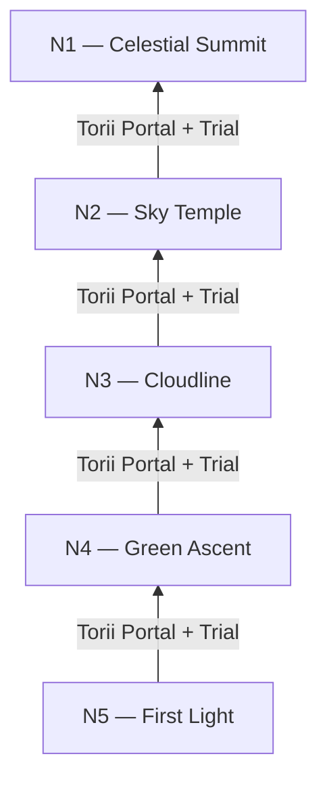

# Connectivity — portals, overview, mind map

## Portal chain (replacing tree branches)



Each transition requires passing the **exit trial** of the lower world (existing portal service pattern in `features/worlds/`).

### Portal character per transition (draft)

| Transition | Mood |
|------------|------|
| N5 → N4 | Dawn into forest; mist bridge — full script in [06-n5-deep-dive.md](./06-n5-deep-dive.md) |
| N4 → N3 | Forest thins; first open ridge |
| N3 → N2 | Breaking through cloud ceiling |
| N2 → N1 | Starfall; rarefied silence |

Cinematic torii crossing aligns with art direction Screen 11 (Region Transition).

---

## World overview (replaces `/tree` mental model)

| Old | New |
|-----|-----|
| Vertical World Tree scroll | **Panorama of five realm silhouettes** stacked by altitude, **or** compass map with five gates |
| Tree zones as scroll rail stops | Realm icons on altitude rail |
| Single canvas spanning all JLPT bands | **Enter one world at a time**; overview shows all five |

### Overview UX rules (from existing trail language)

- Current world **glows**
- Completed worlds show **warm lantern trails**
- Locked worlds are **mist-shrouded but visible** (future path stays visible — art direction Screen 4)

---

## Navigation modes

| Mode | Audience | Behavior |
|------|----------|----------|
| **Guided climb** | New learners | Linear portal chain only |
| **World select** | Placement / returning users | Overview with unlock state (“through N3”) |

Both can coexist: linear story, skippable entry via placement test.

---

## Mind map

```
                    NOBORU ASCENT
                         │
         ┌───────────────┼───────────────┐
         │               │               │
    MYTHOLOGY      PEDAGOGY         COMPANION
    Japan dream    JLPT layers      Yama arc
         │               │               │
         └───────────────┼───────────────┘
                         │
              FIVE REALMS (N5→N1)
                         │
    ┌────────┬──────────┼──────────┬────────┐
    │        │          │          │        │
  Visual  Audio    Landmarks   Trials   Portals
  palette theme    every 5     per      between
  per world        lessons     world    worlds
```

Landmark cadence (`LANDMARK_EVERY_N_LESSONS = 5` in journey constants) still applies within each world.
