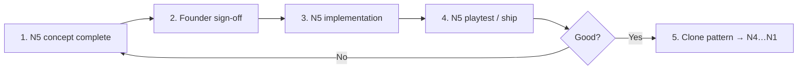

# N5-first rollout strategy

**Status:** Founder direction (2026-06-22)  
**Rule:** **Complete N5 end-to-end before N4–N1.** N5 is the template world.

---

## Pipeline

| Phase | What | Output |
|-------|------|--------|
| **1 — Concept** | Full N5 spec (acts, landmarks, units, trials, art, HUD) | [11-n5-complete-spec.md](./11-n5-complete-spec.md) signed off |
| **2 — Implement** | World canvas, art, landmark pins, act HUD, portal to N4 | Shippable `/worlds/n5` or journey entry for `n5` only |
| **3 — Validate** | Internal playthrough + launch criterion `n5_world` | Founder “template approved” |
| **4 — Replicate** | One deep-dive + spec per world using N5 template | N4 → N3 → N2 → N1 (order fixed) |

**Do not** start N4 concept art, layout code, or deep-dive until N5 validation passes.

---

## What “full N5” means

### Concept complete (before heavy implementation)

- [ ] Three acts named and scoped
- [ ] Landmarks pinned to **real CMS unit order** (not hand-wavy)
- [ ] Trial chain mapped with learner-facing guardian names
- [ ] HUD copy (world title, act label, progress strings)
- [ ] Canvas scroll budget per act
- [ ] Art mood board + asset list (from [06-n5-deep-dive.md](./06-n5-deep-dive.md))
- [ ] **Layout ↔ art workflow** ([12-n5-art-and-node-placement.md](./12-n5-art-and-node-placement.md)) — greybox spine before final art
- [ ] N5 → N4 portal script approved
- [ ] Side-path MVP scope (which quarters ship v1)
- [ ] Founder sign-off on [11-n5-complete-spec.md](./11-n5-complete-spec.md)

### Implementation complete (shippable N5)

- [ ] Migration applied (`n5` region, `act_index` on units)
- [ ] Journey renders **one** N5 scroll with act transitions
- [ ] Landmarks visible at pinned unit boundaries
- [ ] Act label on HUD (`Act II · First steps`)
- [ ] N5 art pack v1 (backdrop + act slices minimum) — pipeline in [12](./12-n5-art-and-node-placement.md)
- [ ] Greybox spine + `journey-path-contracts` rebake for `n5` key
- [ ] Trials playable under `region_slug = n5` with renamed copy
- [ ] `n5-final-trial` opens N4 portal cinematic
- [ ] Launch check `n5_world` passes
- [ ] No learner-facing legacy region names

### Explicitly out of scope for N5 v1

- N4–N1 worlds (placeholder lock only)
- World-tree overview / five-world panorama (can be minimal lock icons)
- Full side-path content for all three hamlet quarters (spine first)
- ~~Re-baking entire `journey-path-contracts.json` (legacy geometry OK short-term)~~ — **N5 requires** `n5` spine rebake per [12](./12-n5-art-and-node-placement.md); other worlds wait

---

## Already done (foundation — Session 5)

These support N5 but are **not** “N5 complete”:

- CMS Option A migration file
- `lib/design-system/worlds.ts` + five slug registry
- Blueprint merged to single `n5` region
- Onboarding copy → Realm of First Light
- Legacy slug normalization at read time

---

## Template for other N’s (after N5 validates)

Each world gets:

1. `NN-nX-complete-spec.md` (clone structure of 11)
2. Acts / zones / landmarks / unit pins
3. Portal script (exit only; N1 may omit)
4. Art pack brief
5. Implementation in isolation — **copy N5 journey module patterns**, not tree code

---

## Related

- [11-n5-complete-spec.md](./11-n5-complete-spec.md) — **work here now**
- [06-n5-deep-dive.md](./06-n5-deep-dive.md) — creative deep-dive (feeds spec)
- [09-cms-decision.md](./09-cms-decision.md) — data model
