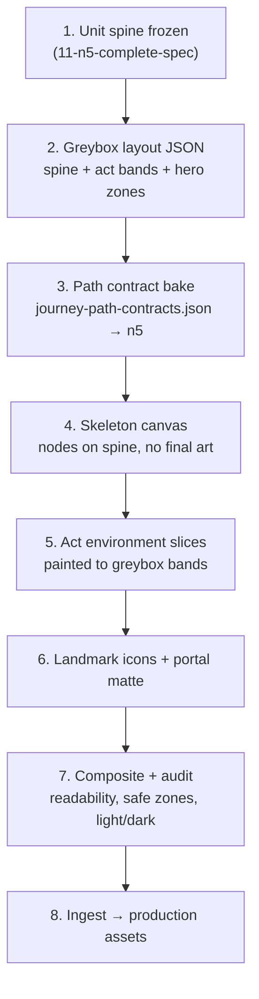

# N5 art ↔ node placement workflow

**Status:** Session 7 draft — **companion to** [11-n5-complete-spec.md](./11-n5-complete-spec.md)  
**Scope:** N5 only. N4–N1 clone this pattern after N5 validates.

This doc answers: **how we place lesson nodes on the scroll**, **how background art is built around those nodes**, and **in what order art and layout work happen** so neither blocks the other.

---

## Core principle

**Curriculum owns *what* nodes exist. Layout owns *where* they sit. Art owns *how* it feels.**

| Layer | Owner | Source of truth |
|-------|--------|-----------------|
| **Nodes** | Journey service | CMS units → lessons + trials; landmarks pinned to unit boundaries ([11](./11-n5-complete-spec.md#landmarks--cms-spine)) |
| **Coordinates** | Path contract | `pathPosition` (0–1) → spine polyline → `{ x%, y% }` on canvas |
| **Backdrop** | Art pipeline | Stacked act slices + parallax; path corridor reserved |
| **Landmark hero art** | Art + layout | Icon/sprites at spine coords; environment “set piece” in slice behind |

Nodes never read pixel positions from art files. Art is authored **to fit** a spine that was agreed in a greybox pass.

---

## Recommended workflow order

Do **not** paint final scroll art before a greybox spine exists. Do **not** ship a spine baked from legacy `mount-n5` geometry without an N5 greybox review.



### Phase summary

| Phase | Deliverable | Who | Blocks |
|-------|-------------|-----|--------|
| **1 — Spine greybox** | `scripts/art-direction/n5-world-layout.json` (proposed) | Design + eng | Final art, path rebake |
| **2 — Contract bake** | `regions.n5` in `journey-path-contracts.json` (replace legacy `mount-n5` key) | Eng | Landmark CMS `path_position` seeds |
| **3 — Skeleton UI** | Canvas with spine overlay + node rings on `%` coords | Eng | Art ingest |
| **4 — Environment art** | 3 act slices + realm silhouette (light/dark) | Art | Full polish |
| **5 — Landmark pack** | 9 transparent icons + optional slice overlays | Art | — |
| **6 — Portal matte** | Gate of Ascent → Mist Bridge frame | Art | N4 placeholder only in matte |
| **7 — Acceptance** | Checklist below | QA + founder | Ship |

**Parallelism:** Phases 4–6 can run in parallel **after** phase 1 spine is signed off. Phase 3 can start as soon as phase 2 is baked.

---

## Coordinate systems (three spaces)

### 1. Scroll canvas (`x%`, `y%`)

Defined in `journey-path-contracts.json`:

- **Width / height:** `1536 × 5120` px reference (`JOURNEY_SCROLL_ART_*` constants).
- **Coordinates:** percentage of canvas (0–100), not pixels in the React layer.
- **Vertical convention:** `y ≈ 94` = journey start (Ember Threshold); `y ≈ 6` = summit (Gate of Ascent).
- **Aspect on device:** canvas scrolls vertically (~480vh minimum per [11](./11-n5-complete-spec.md#world-anatomy)); art is one tall composite or stacked slices with seam overlap.

### 2. Path position (`pathPosition`, 0–1)

Logical position **along the spine polyline**, not raw `y%`.

| Node kind | Assignment |
|-----------|------------|
| **Lessons / trials** | Evenly spaced `0.04 … 0.96` across lesson+trial count in region |
| **Checkpoints** | `checkpointSlots[]` from contract (default `[0.35, 0.68]`) |
| **Landmarks** | `landmarkSlots[]` from contract **or** CMS `path_position` override |
| **Start / portal** | `0` and `1` anchors |

Resolution: `computeJourneyPathCoordinates(pathPosition, 'n5')` → `{ x, y }` via `interpolateAlongJourneyPath`.

### 3. Act bands (`act_index` 1–3)

Acts are **vertical scroll bands**, aligned to path position ranges (tune in greybox):

| Act | Scroll share | `pathPosition` band (v1 target) | Environment slice |
|-----|--------------|----------------------------------|-------------------|
| **I — Awakening** | ~25% (~120vh) | `0.00 – 0.28` | Ember → Script Sanctum → Kana Bridge |
| **II — First steps** | ~35% (~170vh) | `0.28 – 0.63` | Lantern Hamlet → Market Bend |
| **III — Climb begins** | ~40% (~190vh) | `0.63 – 1.00` | Forest Torii → Gate of Ascent |

Act transitions are **visual** (palette shift, sky opening, HUD chip change) — not separate routes. `units.act_index` drives HUD; path contract drives geometry.

---

## How nodes meet art

### Path corridor (safe zone)

Author art so a **winding corridor ~35–45% of canvas width** stays readable for nodes:

- Spine polyline is the centerline of that corridor.
- **Forbidden:** dense foliage, bright highlights, or busy architecture centered on the spine at landmark coords.
- **Encouraged:** landmarks as **off-spine set pieces** (torii beside path, hamlet to the side) with nodes still on the stones.

```
        [Hamlet roofs — midground, left]
                    ╲
    ───●───●───●───●───●───  ← spine + lesson nodes
                    ╱
        [Stream / cliffs — right depth]
```

### Lesson nodes vs background

Per `art-direction/02_journey_trails_and_world_map.md`:

- **Stepping stones / node rings** = UI layer (not baked into background PNG).
- **Background** = full-bleed environment with depth; path glow is composited in the client.
- This lets art iterations happen without rebaking every node pixel.

### Landmarks: two visual roles

| Role | What learner sees | Placement |
|------|-------------------|-----------|
| **Spine landmark node** | Larger ring + label pill on path | `pathPosition` from contract/CMS |
| **Environment set piece** | Painted structure in act slice | Positioned at same `y%` band in layout JSON “hero zones” |

Both must agree on **vertical band**. Horizontal offset is allowed for set pieces; spine node stays on the path.

---

## N5 landmark ↔ path map (v1 targets)

Pin **curriculum** in CMS (unit order from [11](./11-n5-complete-spec.md#landmarks--cms-spine)). Pin **geometry** via CMS `path_position` on each landmark row (overrides generic `landmarkSlots`).

| Landmark | Act | `path_position` (v1) | Hero zone notes |
|----------|-----|----------------------|-----------------|
| Ember Threshold | I | `0.02` | Lowest glow; onboarding camera start |
| Script Sanctum | I | `0.12` | Tablet wall left-of-spine |
| Kana Bridge | I→II | `0.26` | Bridge crosses stream; act I capstone |
| Script Keeper (trial) | I | `0.28` | Boss shrine; red accent band |
| Lantern Hamlet | II | `0.38` | Widest slice; roofs both sides |
| Market Bend | II | `0.50` | Stalls flank path |
| Kana Warden (trial) | II | `0.55` | — |
| Forest Torii | II→III | `0.62` | Large torii **beside** path; particle gate |
| Kanji Grove | III | `0.72` | Pillars recede uphill |
| First Slope Shrine | III | `0.84` | Mountain visible above |
| Trail Warden / Sentinel / Guardian | III | `0.90 – 0.98` | Steep ascent; Gate of Ascent at `0.98` |

**Checkpoints** (trail camps, not named landmarks): use `checkpointSlots` at `0.20`, `0.45`, `0.78` in N5 contract (expand from default 2 slots).

Values are **greybox defaults** — adjust after skeleton playthrough so labels do not collide with art features.

---

## What replaces World Tree composition

| Legacy (retire) | N5 replacement |
|-----------------|----------------|
| `world-tree-composition-layout.json` (trunk puzzle pieces) | `n5-world-layout.json` — act slices + hero zones + spine |
| `world-tree-manifest.json` segment stack | `n5-world-manifest.json` (proposed) — backdrop + slice assets |
| `journey-path-contracts` key `mount-n5` | New key **`n5`** with N5-specific spine + 8+ landmark slots |
| Multi-region vertical stack on one tree | **Single-world scroll** per JLPT realm |

### Proposed `n5-world-layout.json` shape

```json
{
  "version": 1,
  "world": "n5",
  "canvas": { "width": 1536, "height": 5120 },
  "acts": [
    { "actIndex": 1, "yStart": 0.72, "yEnd": 0.94, "sliceAsset": "bg-n5-act1" },
    { "actIndex": 2, "yStart": 0.37, "yEnd": 0.72, "sliceAsset": "bg-n5-act2" },
    { "actIndex": 3, "yStart": 0.06, "yEnd": 0.37, "sliceAsset": "bg-n5-act3" }
  ],
  "heroZones": [
    { "id": "ember-threshold", "pathPosition": 0.02, "anchor": { "x": 50, "y": 93 }, "setPieceOffset": { "x": -8, "y": 0 } }
  ],
  "spine": { "dark": [], "light": [] }
}
```

Eng copies finalized `spine` + slots into `journey-path-contracts.json`. Art uses `acts` + `heroZones` for slice generation briefs.

---

## Art creation pipeline (N5 v1)

Follow `art-direction/05_cursor_generation_brief.md` and `08_visual_art_direction_master_spec.md`. Mood keywords from [06-n5-deep-dive.md](./06-n5-deep-dive.md#mood-board-keywords-art-agent-brief).

### Step-by-step

| Step | Action | Output |
|------|--------|--------|
| **1. Brief** | Per-slice prompt: act band, hero zones, forbidden elements, palette | [14-n5-art-generation-briefs.md](./14-n5-art-generation-briefs.md) |
| **2. Greybox reference** | Export skeleton PNG with spine + node dots | `Art Library/staging/n5-greybox.png` |
| **3. Generate** | Cursor / ComfyUI — **one slice at a time** | `Art Library/backgrounds/n5_*_light_v1.png` + `_dark_v1` |
| **4. Icons** | Landmark thumbnails — **transparent alpha** | `Art Library/icons/landmark-n5-*_light_v1.png` |
| **5. Post-process** | `strip-icon-backgrounds.mjs`, `audit-transparency.mjs` | Pass/fail report |
| **6. Portal matte** | Single cinematic frame N5→N4 | `Art Library/backgrounds/portal-n5-n4_*` |
| **7. Ingest** | `ingest-staging.mjs` / `publish-art-library.mjs` → `public/` or asset registry | Production paths |
| **8. Registry** | Metadata: world, act, theme, landmark id | Asset pipeline registry |

### Minimum shippable set (unchanged from 11)

1. Realm silhouette (overview)
2. Act I slice (Script Sanctum readable)
3. Act II slice (Hamlet + Market)
4. Act III slice (First Slope + Gate)
5. Nine landmark icons
6. Portal matte

**Not v1:** hamlet quarter backgrounds, parallax layers beyond one midground pass.

### Art ↔ layout feedback loop

1. Drop slice into skeleton canvas at correct `y` band.
2. Verify node rings at 44px+ touch targets contrast against local background.
3. If a landmark set piece obscures the path → **move set piece in layout JSON**, not the curriculum pin.
4. If spine feels flat → add polyline control points and rebake contract only (no CMS change).

---

## Engineering touchpoints (when promoted from JWorld)

| File | Change |
|------|--------|
| `lib/design-system/journey-path-contracts.json` | Add `n5` region; deprecate `mount-n5` mapping in `journey-path-contracts.ts` |
| `lib/design-system/journey-path-contracts.ts` | `PATH_CONTRACT_JSON_KEYS.n5` → `"n5"` |
| `features/journey/utils/journey-path.builder.ts` | Already supports CMS landmark `path_position` overrides |
| `scripts/art-direction/n5-world-layout.json` | New — greybox + hero zones |
| Journey canvas components | Rebuild under `features/journey/components/` or `features/worlds/` — spine + slice stack + node layer |

**CMS seed (optional v1):** `journey_landmarks` rows for N5 with `path_position` from table above, keyed to unit `order_index` after migration.

---

## Acceptance criteria

### Readability

- [ ] Current lesson node: amber ring visible on **both** themes at every act band.
- [ ] Locked nodes: legible lock icon; not hidden in fog that matches node grey.
- [ ] Landmark labels: dark glass pill + gold border ([02 journey trails](./../../art-direction/02_journey_trails_and_world_map.md)).

### Safe zones

- [ ] No landmark label overlaps another node within 48px at 390px viewport width.
- [ ] Path corridor free of high-frequency detail under node centers (manual audit on skeleton).

### Art quality

- [ ] Every shipped asset has `_light` + `_dark` pair (except theme-specific cinematics).
- [ ] Icons: true RGBA alpha post-`strip-icon-backgrounds.mjs`.
- [ ] No world-tree, root network, or trunk imagery in N5 pack.

### Curriculum integrity

- [ ] Landmark nodes appear after correct unit per [11](./11-n5-complete-spec.md#landmarks--cms-spine).
- [ ] Trials at correct gates; display names only in UI.
- [ ] Act HUD chip matches `units.act_index` for current node.

### Performance

- [ ] Act slices WebP/AVIF where supported; lazy load bands below fold.
- [ ] Initial N5 entry paints Act I slice first ([performance targets](../../.cursor/rules/performance.mdc)).

---

## Open items (N5 placement)

| # | Question | Proposed default |
|---|----------|------------------|
| 1 | Bake spine from greybox tool or hand-edit JSON? | Hand-edit v1; tool if N4+ needs speed |
| 2 | Stacked slices vs single tall PNG? | **Stacked 3 slices** — faster iteration, smaller LCP |
| 3 | Side paths (Food Stall Row): separate `trail` spine? | Defer v1; Act II `trails[0]` reserved |
| 4 | Parallax layers | v1.1 — static slices ship first |

---

## Related

- [11-n5-complete-spec.md](./11-n5-complete-spec.md) — units, landmarks, art minimum
- [06-n5-deep-dive.md](./06-n5-deep-dive.md) — mood board, landmark silhouettes
- [10-n5-rollout-strategy.md](./10-n5-rollout-strategy.md) — phase gates
- `lib/design-system/journey-path-contracts.ts` — runtime coordinate API
- `art-direction/05_cursor_generation_brief.md` — generation rules
- `art-direction/06_asset_inventory_and_naming.md` — Art Library paths
