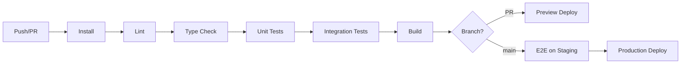

# Noboru Deployment

Version: 1.0

Status: AUTHORITATIVE

This document defines hosting, environment configuration, Supabase integration, CI/CD pipeline, and preview deployment strategy for Noboru.

**Related documents:** [MASTER_PROMPT.md](./MASTER_PROMPT.md), [testing-strategy.md](./testing-strategy.md), [api-specification.md](./api-specification.md)

---

## Deployment Philosophy

From [MASTER_PROMPT.md](./MASTER_PROMPT.md):

> Ship stable. Not fast. Quality beats speed.

Pipeline stages:

```
Development → Testing → Staging → Production
```

---

## Hosting: Vercel

Noboru is deployed on **Vercel** as a Next.js 15 application.

### Why Vercel

- Native Next.js App Router support
- Automatic preview deployments per PR
- Edge middleware for Supabase session refresh
- Global CDN for static assets and PWA
- Environment variable management per environment

### Deployment Targets

| Environment | Branch | URL Pattern |
|-------------|--------|-------------|
| Development | local | `localhost:3000` |
| Preview | PR branches | `noboru-*.vercel.app` |
| Staging | `staging` | `staging.noboru.app` (future) |
| Production | `main` | `noboru.app` (future) |

---

## Environment Variables

### Required (All Environments)

From `.env.example`:

| Variable | Scope | Description |
|----------|-------|-------------|
| `NEXT_PUBLIC_SUPABASE_URL` | Public | Supabase project URL |
| `NEXT_PUBLIC_SUPABASE_ANON_KEY` | Public | Supabase anonymous key |

### Server-Only (Never `NEXT_PUBLIC_`)

| Variable | Description |
|----------|-------------|
| `SUPABASE_SERVICE_ROLE_KEY` | Admin operations, bypasses RLS — server only |
| `DATABASE_URL` | Direct PostgreSQL connection (migrations, scripts) |

### Future Variables

| Variable | Description |
|----------|-------------|
| `NEXT_PUBLIC_POSTHOG_KEY` | Analytics (PostHog) |
| `NEXT_PUBLIC_POSTHOG_HOST` | PostHog host URL |
| `SENTRY_DSN` | Error monitoring |

### Environment Rules

1. Never commit `.env` files — use `.env.example` as template
2. Set variables in Vercel dashboard per environment
3. Preview deployments inherit development/staging Supabase project
4. Production uses isolated Supabase project with separate keys
5. Rotate keys on compromise — never log key values

---

## Supabase

### Services Used

| Service | Purpose |
|---------|---------|
| Supabase Auth | Email registration, login, session management |
| PostgreSQL | Primary database (see [database-schema.md](./database-schema.md)) |
| Row Level Security | User data isolation |
| Storage | Audio files, assets (future) |
| Edge Functions | Background jobs (future) |

### Supabase Client Setup

| File | Context |
|------|---------|
| `lib/supabase/client.ts` | Browser client |
| `lib/supabase/server.ts` | Server components and API routes |
| `lib/supabase/middleware.ts` | Session refresh on protected routes |

### Migrations

```
supabase/migrations/
```

- All schema changes via migration files
- Migrations must update [database-schema.md](./database-schema.md)
- Run migrations against staging before production
- Never modify production schema manually

### RLS Policy Deployment

- RLS policies deployed with migrations
- Every user-owned table requires RLS
- Test RLS in integration tests before production deploy

---

## Build Configuration

### Scripts

From `package.json`:

```json
{
  "dev": "next dev",
  "build": "next build",
  "start": "next start",
  "lint": "next lint",
  "typecheck": "tsc --noEmit"
}
```

### Future Scripts

```json
{
  "test": "vitest",
  "test:e2e": "playwright test",
  "test:coverage": "vitest --coverage"
}
```

### Build Requirements

- `next build` must succeed with zero type errors
- No ESLint errors on production deploy
- Static assets served from `public/` (icons, manifest, mascots)

---

## CI/CD Pipeline

### Trigger Events

| Event | Pipeline |
|-------|----------|
| Pull request | Lint → Type check → Unit tests → Build → Preview deploy |
| Merge to `main` | Full pipeline → Production deploy |
| Manual | Staging deploy, migration run |

### Pipeline Stages



### CI/CD Requirements

From [MASTER_PROMPT.md](./MASTER_PROMPT.md):

- Lint
- Type check
- Unit tests
- Integration tests
- Build verification
- Deployment validation

### GitHub Actions (Outline)

```yaml
# .github/workflows/ci.yml (conceptual)
name: CI
on: [push, pull_request]
jobs:
  quality:
    runs-on: ubuntu-latest
    steps:
      - uses: actions/checkout@v4
      - uses: actions/setup-node@v4
      - run: npm ci
      - run: npm run lint
      - run: npm run typecheck
      - run: npm run test        # when Vitest configured
      - run: npm run build
```

Vercel GitHub integration handles preview and production deployments automatically on successful checks.

---

## Preview Deployments

### Behavior

- Every PR generates a unique Vercel preview URL
- Preview uses staging/development Supabase project
- Environment variables scoped in Vercel per environment

### Preview Testing Checklist

- [ ] Auth flow (register/login)
- [ ] Onboarding completes
- [ ] Home dashboard renders
- [ ] Lesson player loads
- [ ] Review session functions
- [ ] Theme toggle works
- [ ] Mobile viewport correct
- [ ] PWA manifest valid

### Preview Limitations

- Do not use preview for production data
- Do not run destructive migrations against preview-linked databases
- E2E tests may target preview URLs in CI

---

## PWA Deployment

From `public/manifest.json`:

- `start_url`: `/tree`
- `display`: `standalone`
- Icons: `public/icons/` (`icon-192_v1.webp`, `icon-512_v1.webp`, maskable variants, `apple-touch-icon_v1.png`)
- Splash screens: `public/icons/splash/` (`apple-touch-startup-image` links in root layout)

### PWA Requirements

- Service worker: `public/sw.js` (cache-first static assets, network-first navigation, offline fallback at `/offline`)
- Manifest served from `public/manifest.json`
- HTTPS required (Vercel provides automatically)
- Install prompt on supported browsers; iOS Safari uses Share → Add to Home Screen guide
- Regenerate icons after art updates: `npm run pwa:icons`
- Validate before deploy: `npm run pwa:validate`

### iOS Notes

- Background Sync API is **not** available on iOS Safari. Offline mutations sync on reconnect, manual sync, or when the standalone app is reopened online.
- Home screen icon requires `apple-touch-icon_v1.png` and manifest icons (screenshot fallback otherwise).

---

## Asset Deployment

Public assets map from `assets/` source to `public/` served paths.

Registry: `lib/assets/registry.ts` (see [asset-registry.md](./asset-registry.md))

Asset files must exist in `public/` before deployment:

```
public/
├── icons/
│   ├── icon_app_light_v1.webp
│   ├── icon_app_dark_v1.webp
│   ├── icon-192_v1.webp
│   ├── icon-512_v1.webp
│   ├── apple-touch-icon_v1.png
│   └── splash/
├── mascots/
│   ├── yama_main_light_v1.webp
│   └── yama_main_dark_v1.webp
├── sw.js
└── manifest.json
```

---

## Monitoring (Future)

| Service | Purpose |
|---------|---------|
| Vercel Analytics | Web vitals, performance |
| Vercel Speed Insights | Real-user monitoring (active in `app/layout.tsx`) |
| PostHog | Product analytics |
| Sentry | Error tracking |
| Supabase Dashboard | Database health, auth metrics |

### Performance Monitoring

- **Authenticated routes:** Lighthouse CI (`.github/workflows/lighthouse.yml`) audits `/camp`, `/tree`, `/review`, and optionally `/learn/lesson/[id]` when `LIGHTHOUSE_LESSON_ID` secret is set.
- **API rate limits:** `lib/api/rate-limit.ts` guards hot POST routes (review submit/batch, offline sync, game complete, shop purchase, lesson progress, reading/listening progress, trial complete, chest claim, analytics batch, league/friends mutations). Replace with Upstash/Vercel KV for multi-instance production scale.
- **Bundle analysis:** run `npm run analyze` locally to open the webpack bundle analyzer (`ANALYZE=true` during `next build`).

---

- Build failure → immediate notification
- Error rate spike → investigate within 1 hour
- Database connection failures → immediate notification

---

## Rollback Strategy

1. **Vercel instant rollback** — redeploy previous production deployment
2. **Database rollback** — migration down scripts (tested in staging)
3. **Feature flags** — disable broken features without full rollback (future)

Never force-push to `main`. Never skip CI checks for production deploys.

---

## Security Checklist (Pre-Deploy)

- [ ] No secrets in client bundle
- [ ] RLS enabled on all user tables
- [ ] Service role key server-only
- [ ] CORS configured correctly
- [ ] Auth middleware active on protected routes
- [ ] Admin routes role-gated
- [ ] Dependencies audited (`npm audit`)

---

## Local Development

```bash
# Clone and setup
cp .env.example .env.local
# Fill in Supabase credentials

npm install
npm run dev
# → http://localhost:3000
```

Local development uses the same Supabase project as preview (never production).

---

END OF deployment.md
