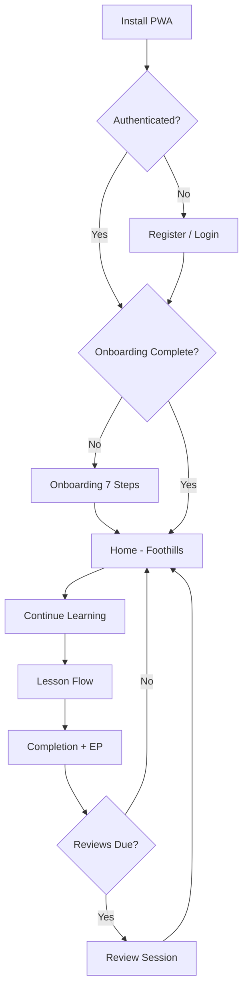

# Noboru User Flows

Version: 1.0

Status: AUTHORITATIVE

This document defines key user journeys through Noboru. All screen design and implementation must support these flows.

**Related documents:** [prd.md](./prd.md), [uiux.mdc](../.cursor/rules/uiux.mdc), [personas.md](./personas.md), [information-architecture.md](./information-architecture.md)

---

## Flow Design Principles

From [uiux.mdc](../.cursor/rules/uiux.mdc):

- **Mobile first** — thumb-reachable primary actions
- **One primary action per screen**
- **3-second clarity** — Where am I? What should I do? Why does it matter? What progress am I making?
- **Calm recovery** — errors explain and offer next steps; never technical jargon
- **Ascent feedback** — progression reinforces the climb metaphor

---

## Flow 1: Authentication

### Entry Points

- App launch (unauthenticated)
- Session expiry
- Explicit sign-out from Settings

### Paths

#### Register (New User)

```
Landing → Register → Email + Password → Email Verification (if enabled)
→ Onboarding Flow → Home
```

#### Login (Returning User)

```
Landing → Login → Email + Password → Session Restored → Home
```

#### Password Reset

```
Login → Forgot Password → Email → Reset Link → New Password → Login → Home
```

### Requirements

From [prd.md](./prd.md):

| Capability | Status |
|------------|--------|
| Email registration | MVP |
| Email login | MVP |
| Password reset | MVP |
| Remember session | MVP |
| Guest mode | Post-MVP (optional) |

### Architecture

```
Page (UI) → Hook → auth.service.ts → auth.repository.ts → Supabase Auth
```

See [api-specification.md](./api-specification.md) and `features/authentication/`.

### UX Rules

- One primary CTA per auth screen
- Loading skeletons during session check — never blank screens
- Error states: calm message + retry action
- Post-auth redirect: onboarding (new) or home (returning with completed onboarding)

---

## Flow 2: Onboarding

### Trigger

First authenticated session without completed onboarding profile.

### Steps

| Step | Screen | User Action | System Response |
|------|--------|-------------|-----------------|
| 1 | Welcome to Noboru | Tap Continue | Brand introduction |
| 2 | Why Are You Learning? | Select goal | Store learning_goal (Anime, Travel, Culture, Work, JLPT) |
| 3 | Current Level | Select level | Store placement (None, N5–N1) |
| 4 | Daily Goal | Select duration | Store daily_goal_minutes (5, 10, 20, 30, 60) |
| 5 | Theme Preference | Light or Dark | Store theme (default: Dark) |
| 6 | Meet Yama | Tap Continue | Show canonical Yama asset for selected theme |
| 7 | Begin Ascent | Tap Start | Initialize progress, redirect to Foothills |

### Yama Asset Selection

- Light theme → `yama_main_light_v1`
- Dark theme → `yama_main_dark_v1`

See [asset-registry.md](./asset-registry.md).

### Completion State

- `onboarding_completed = true` on profile
- User lands on Home with Foothills as current region
- First lesson available in Learn tab

### Empty / Error Handling

- Back navigation allowed until step 7
- Network failure: queue preferences locally, sync on reconnect
- Skip not permitted — onboarding establishes personalization baseline

---

## Flow 3: Daily Study

### Entry Point

Home tab (primary daily entry).

### Home Dashboard Elements

From [prd.md](./prd.md) and [uiux.mdc](../.cursor/rules/uiux.mdc):

- Current Region
- Current Trail
- Continue Learning (primary CTA)
- Daily Goal progress
- Elevation Progress
- Recent Achievement
- Review Queue count
- Daily Quest

### Happy Path

```
Open App → Home → Continue Learning → Lesson Intro → Teaching → Guided Practice
→ Recognition → Recall → Review → Completion → Elevation Gained → Home
```

### Alternate Paths

| Path | Trigger | Flow |
|------|---------|------|
| Review first | Reviews due > 0 | Home → Review Queue card → Review Session |
| Quest-driven | Daily quest incomplete | Home → Quest card → Target activity |
| Game practice | User chooses reinforcement | Home → Games tab → Select game |

### Daily Goal Tracking

- Progress bar on Home reflects minutes or activities completed
- Goal completion triggers success moment — not addictive loop
- Missing a day: no guilt messaging (see Streak Rule in [uiux.mdc](../.cursor/rules/uiux.mdc))

### Offline Path

```
Open App (offline) → Home → Continue Learning (cached lesson)
→ Complete lesson → Progress saved locally → Sync on reconnect
```

---

## Flow 4: Review Session

### Entry Points

- Review tab
- Home → Review Queue card
- Post-lesson review prompt
- Daily quest: "Review 20 Items"

### Review Center (Hub)

Displays:

- Due reviews count
- Review history
- Mastery stats
- Weak areas

### Session Flow

```
Review Tab → Start Review → Card Presented → User Response (Again / Good / Strong)
→ Next Card → ... → Session Summary → Mastery Updated → Return to Hub
```

### SRS States

From [prd.md](./prd.md):

`New → Learning → Good → Strong → Mastered → Legendary`

Intervals: 1, 3, 7, 14, 30, 90, 180, 365 days

### Session End States

| State | UI |
|-------|-----|
| All reviews complete | Celebration + "No reviews due" empty state with next action |
| Partial session | Save progress, show remaining count |
| Offline | Queue review results locally, sync later |

### UX Rules

- One card focus at a time
- Swipe or tap for responses — thumb reachable
- No timer pressure on reviews (unlike games)
- Weak area alerts link directly to focused review sets

---

## Flow 5: Lesson Completion

### Trigger

User completes final step of any lesson.

### Lesson Structure

From [prd.md](./prd.md):

Introduction → Teaching → Guided Practice → Recognition → Recall → Review → Completion

### Completion Sequence

```
Final Step Complete → Success Animation → Results Summary
→ Elevation Gained → Quest Progress Updated → Achievement Check
→ Continue (Next Lesson / Return to Learn / Home)
```

### Data Updates

- `user_progress` — lesson marked complete
- `user_reviews` — new items enter SRS
- `user_elevation` — EP awarded
- `user_quests` — daily quest progress
- `user_achievements` — unlock if criteria met

### Success Moments

From [uiux.mdc](../.cursor/rules/uiux.mdc):

- Lesson Completion
- Trail Advanced
- Region Cleared
- Achievement Unlock
- Quest Completion

Animations must communicate progress — not decorate.

---

## Flow 6: Learn Path Navigation

### Entry Point

Learn tab.

### Hierarchy

```
Learn → Region List → Unit List → Lesson List → Lesson Detail → Start Lesson
```

### MVP Regions

- Foothills
- Forest Trail
- Mount N5

### Learn Tab Displays

- Regions with progress indicators
- Units within selected region
- Lessons with lock/unlock states
- Upcoming challenges preview

### Navigation Rules

- Maximum depth: Region → Unit → Lesson → Lesson Session
- Breadcrumb or back affordance at every level
- Locked content explains prerequisite — never silent lock

---

## Flow 7: Profile & Settings

### Profile Tab

Displays:

- Avatar / Yama variant
- Current region and level
- Elevation and mastery stats
- Achievements gallery
- Recent activity

### Settings Access

```
Profile → Settings (gear icon or settings link)
```

### Settings Sections

From [prd.md](./prd.md):

| Section | Options |
|---------|---------|
| Theme | Light / Dark / System |
| Language | UI language (future) |
| Audio | Playback speed, auto-play |
| Notifications | Daily reminder, review reminder, quest/achievement |
| Accessibility | Reduced motion, large text, high contrast |
| Data Sync | Manual sync, offline status |
| Account | Email, password, sign out, delete account |

### Account Flows

```
Settings → Sign Out → Confirm → Landing/Login
Settings → Delete Account → Confirm (typed) → Account Removed → Landing
```

---

## Flow 8: Games (Supplementary)

### Entry Point

Games tab.

### Flow

```
Games → Game List → Select Game → Difficulty → Play → Results → EP/Rewards → Games
```

MVP games: Kanji Hunter, Vocabulary Rush, Memory Dungeon, Word Match, Reading Challenge.

Games unlock through region progress and educational milestones — never purchases.

See [game-design.md](./game-design.md).

---

## Flow Diagram: First-Time User



---

## Offline State Flow

All core flows must degrade gracefully:

| Flow | Offline Behavior |
|------|------------------|
| Daily study | Cached lessons available |
| Review | Local SRS queue |
| Progress | IndexedDB write, background sync |
| Auth | Session cached; new auth requires network |
| Settings | Local preferences apply immediately |

---

## Accessibility Across Flows

- All flows support keyboard navigation and screen readers
- Reduced motion preference disables non-essential animations
- Touch targets meet minimum size for mobile
- Color is never the sole indicator of state

---

END OF user-flows.md
